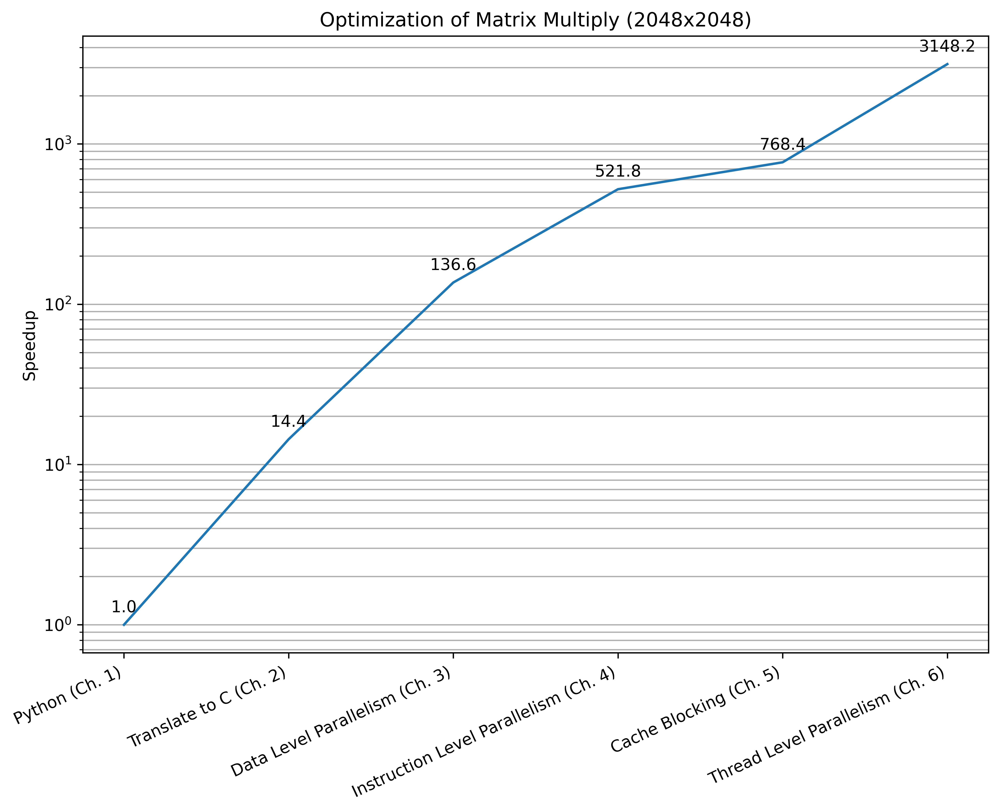
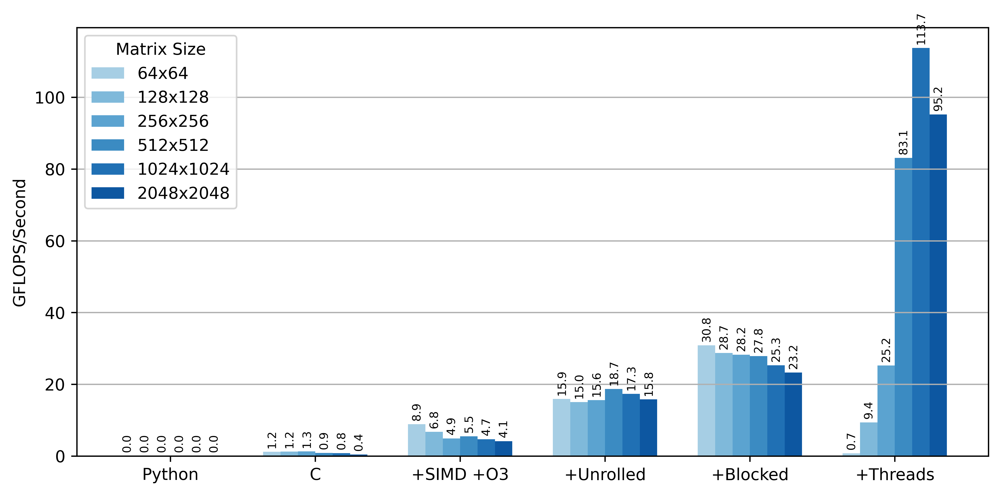

# COD_RISCV — DGEMM Performance Evolution

This project implements and benchmarks **DGEMM (Double-Precision General Matrix Multiply)** inspired by *Computer Organization and Design: RISC-V Edition* for M3 Pro Hardware specifically.

---

## Implementations

### `01_python_baseline`
- Pure python implementation
- Extremely slow, used as correctness reference
- Baseline O(n³) cost

### `02_c_baseline`
- Translation to C from python
- Major speedup from compiled code

### `03_SIMD`
- Vectorized implementation using SIMD instructions
- Improves arithmetic throughput

### `04_ILP`
- Instruction level parallelism optimizations
- Loop unrolling for better CPU utilization
- Improves compute efficiency on single core

### `05_cache_blocking`
- Cache aware matrix blocking (tiling)
- Dramatically reduces cache misses

### `06_multicore`
- Multithreaded implementation
- Uses multiple CPU cores (OpenMP / pthreads depending on build)

---

## Results

All benchmarks are collected into CSV files under the results folder, here's some relevant plots

  

  

